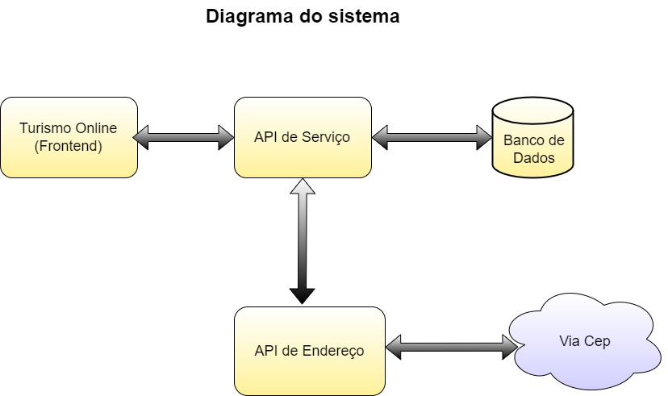
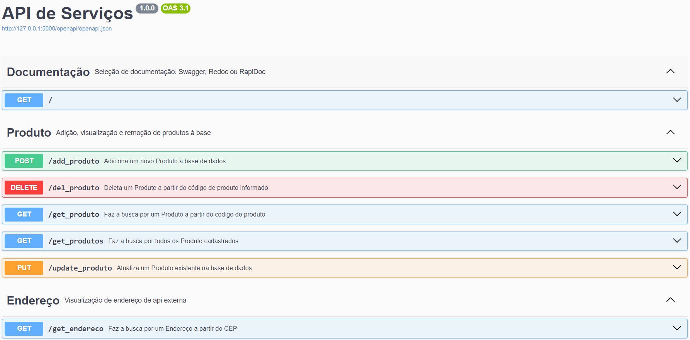

# Projeto MVP Micriserviço

Este pequeno projeto é o MVP da disciplina **Arquitetura de Software** 

O objetivo é criar uma pequena POC (`Proof of consept`) de um sistema de e-comerce com o conteúdo apresentado nas disciplinas.

# Api de serviços

Esta é a camada de negócios do sistema, que é acessava via API rest.
Atravez de api, também é possivel acessar um serviço de endereços.

## Diagrama da Aplicação


---
## Endpoint disponibilizados


---
## Como executar 


O sistema foi desenvolvido em Python 3.12.2.

> É fortemente indicado o uso de ambiente virtual utilize o comando:

```
 python -m venv env
```

Será necessário ter todas as libs python listadas no `requirements.txt` instaladas em um ambiente virtual.

```
(env)$ pip install -r requirements.txt
```

Para executar a API  basta executar:

```
(env)$ flask run --host 0.0.0.0 --port 5000
```

Abra o [http://localhost:5000/#/](http://localhost:5000/#/) no navegador para verificar o status da API em execução.


## Como executar através do Docker

Certifique-se de ter o [Docker](https://docs.docker.com/engine/install/) instalado e em execução em sua máquina.

Navegue até o diretório que contém o Dockerfile e o requirements.txt no terminal.
Execute **como administrador** o seguinte comando para construir a imagem Docker:

```
docker build -t turismo_online_api_servicos .
```

Uma vez criada a imagem, para executar o container basta executar, **como administrador**, seguinte o comando:

```
docker run -p 5000:5000 turismo_online_api_servicos
```

Uma vez executando, para acessar a API, basta abrir o [http://localhost:5000/#/](http://localhost:5000/#/) no navegador.


### Alguns comandos úteis do Docker

>**Para verificar se a imagem foi criada** você pode executar o seguinte comando:
>
>```
>$ docker images
>```
>
> Caso queira **remover uma imagem**, basta executar o comando:
>```
>$ docker rmi <IMAGE ID>
>```
>Subistituindo o `IMAGE ID` pelo código da imagem
>
>**Para verificar se o container está em exceução** você pode executar o seguinte comando:
>
>```
>$ docker container ls --all
>```
>
> Caso queira **parar um conatiner**, basta executar o comando:
>```
>$ docker stop <CONTAINER ID>
>```
>Subistituindo o `CONTAINER ID` pelo ID do conatiner
>
>
> Caso queira **destruir um conatiner**, basta executar o comando:
>```
>$ docker rm <CONTAINER ID>
>```
>Para mais comandos, veja a [documentação do docker](https://docs.docker.com/engine/reference/run/).
